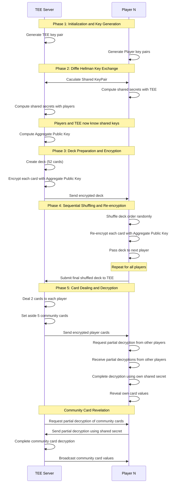

# Mermaid Sequence Diagram: Diffie-Hellman TEE-Based Secure Card Game

## Key Security Features Highlighted:

1. **TEE Trust**: All critical operations happen in trusted execution environment
2. **Diffie-Hellman Security**: Each player has unique shared secret with TEE
3. **Collective Encryption**: Aggregate public key requires all players' cooperation
4. **Sequential Shuffling**: Each player contributes to deck randomization
5. **Partial Decryption**: Cards can only be revealed with all players' cooperation
6. **Privacy Preservation**: Players can only see their own cards individually

## Cryptographic Operations:
- **Key Generation**: ElGamal key pairs
- **Diffie-Hellman**: Shared secret computation
- **ElGamal Encryption**: Card encryption
- **ElGamal Decryption**: Card decryption
- **Re-encryption**: Card re-encryption for shuffling 